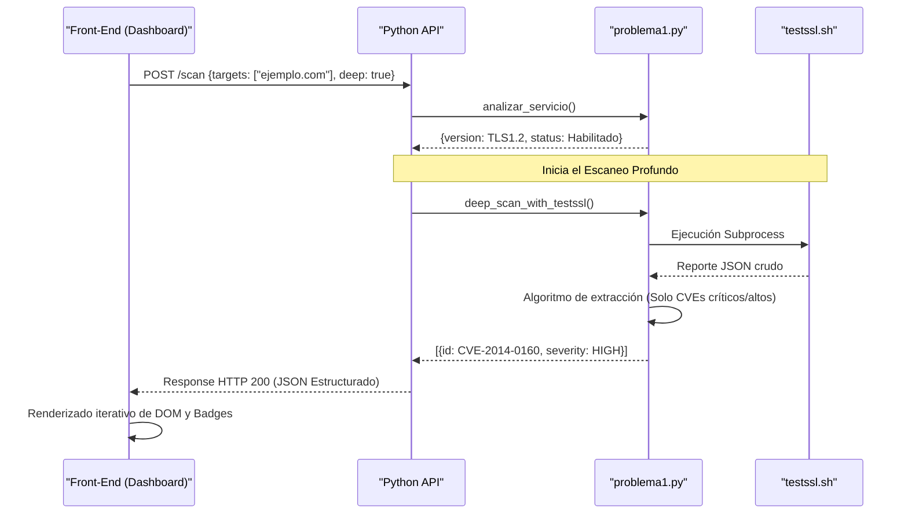

# 🛡️ Shield TLS: Plataforma Avanzada de Análisis de Configuración TLS

**Plataforma Integral de Ciberseguridad para Análisis de Transporte Criptográfico y Detección Temprana de Vulnerabilidades (Deep Scan).**

Shield TLS es una suite de auditoría desarrollada para el reto "Operación Defensa Web: Análisis de Configuración TLS" de Risaralda. Permite a analistas y DevSecOps evaluar la configuración criptográfica de servidores mediante una **Interfaz Gráfica Premium**, una **API REST veloz** y una **CLI poderosa**.

---

## 🏗️ Arquitectura de Micro-Servicios en Python

El proyecto ha sido modularizado para separar las responsabilidades, asegurar la escalabilidad y permitir su despliegue tanto en terminales locales como en contenedores en la nube.

### 1. El Motor Core (`problema1.py`)
Es el corazón algorítmico del sistema. Implementa dos capas de auditoría:
*   **Fast Handshake (Nativo)**: Usa la librería `ssl` nativa de Python para establecer un socket TCP en milisegundos y negociar la versión máxima de TLS soportada por el servidor remoto.
*   **Deep Scan Engine (testssl.sh)**: Delega el escaneo profundo mediante `subprocess`, inyectando la carga de cientos de pruebas criptográficas contra el objetivo y *parseando* el JSON resultante de vulnerabilidades (CVEs, Heartbleed, Ticketbleed, etc.).

### 2. La API REST (`server_api.py`)
Expone la funcionalidad del motor a través de una API moderna construida con **FastAPI**.
*   **Puerto**: 8081
*   **Propósito**: Permite integraciones programáticas (Webhook/CI-CD) y sirve como el backend principal cuando la herramienta se despliega en arquitecturas distribuidas. Documentación autogenerada (Swagger/OpenAPI).

### 3. El Servidor Visual (`server.py`)
Un servidor ligero construido con la librería estándar `http.server`.
*   **Puerto**: 8000
*   **Propósito**: Entrega la capa de Front-End *(HTML, CSS con Tailwind, y JS)* directamente al navegador del analista. Actúa como proxy que enlaza la UI con la lógica de análisis a través del endpoint `/api/scan`.

### 4. La Consola Interactiva (`algo/cli/shield.py`)
Una herramienta de terminal basada en **Typer** y **Rich**.
*   **Propósito**: Permite a los SysAdmins realizar auditorías masivas leyendo archivos CSV o pasando argumentos bash directamente en la terminal, dibujando tablas dinámicas espectaculares en tiempo real, sin usar el ratón.

---

## 🗺️ Mapa de Arquitectura Visual

```mermaid
graph TD
    classDef client fill:#E1F5FE,stroke:#03A9F4,stroke-width:2px;
    classDef backend fill:#E8F5E9,stroke:#4CAF50,stroke-width:2px;
    classDef engine fill:#FFF3E0,stroke:#FF9800,stroke-width:2px;
    classDef external fill:#FCE4EC,stroke:#E91E63,stroke-width:2px;

    UserBrowser(["🌐 Navegador Web"]):::client
    CLIUser(["💻 Operador CLI"]):::client

    subgraph Node_Local ["Entorno Frontend"]
        GUI_Server["🖥️ server.py (Puerto 8000)"]:::backend
    end

    subgraph Node_VPS ["Backend & API"]
        FastAPI_Server["⚡ server_api.py (Puerto 8081)"]:::backend
        ShieldCLI["🚀 cli/shield.py"]:::client
    end

    subgraph Core_Engine ["Motor de Auditoría"]
        Engine["⚙️ problema1.py"]:::engine
        PySSL["🐍 Python Native SSL"]:::engine
        TestSSL["🧰 testssl.sh Wrapper"]:::engine
    end

    Target(("🎯 Servidor Objetivo")):::external

    UserBrowser -->|POST /api/scan| GUI_Server
    CLIUser --> ShieldCLI
    
    GUI_Server --> Engine
    FastAPI_Server --> Engine
    ShieldCLI --> Engine

    Engine -->|Auditoría Básica| PySSL
    Engine -->|Deep Scan (Opcional)| TestSSL

    PySSL -->|TCP 443| Target
    TestSSL -->|Probes TCP| Target
```

---

## 🧠 Lógica de Clasificación y Reportes

La herramienta no muestra datos crudos, **evalúa y clasifica** para generar reportes ejecutivos listos para la toma de decisiones.

### Motor de Reglas (Severidad)
El algoritmo procesa la compatibilidad detectada y le asigna criticidad basándose en el estándar *NIST SP 800-52 Rev. 2* y *OWASP*:

| Protocolo Detectado | Riesgo / Criticidad | Explicación del Motor | Recomendación Automatizada |
| :--- | :---: | :--- | :--- |
| **TLS 1.0 / 1.1** | 🔴 **ALTA** | Obsoleto, propenso a downgrade, POODLE, BEAST. | Deshabilitar explícitamente en el proxy/servidor. |
| **TLS 1.2** | 🟡 **MEDIA** | Protocolo de transición. Seguro si el cifrado es fuerte. | Monitorizar ciphers y preparar salto a 1.3. |
| **TLS 1.3** | 🟢 **BAJA** | Protocolo ideal (Perfect Forward Secrecy). | Mantener postura óptima de configuración. |
| **ERROR / NULO** | 🔴 **CRÍTICA** | No se logró handshake TLS o el puerto está cerrado. | Revisar firewall o certificado SSL ausente. |

### Generación de Reportes
El Front-end renderiza esta clasificación de forma interactiva (Glassmorphism), agrupando los hallazgos en una tabla con **badges de color**. Al activar el _Deep Scan_, `app.js` inyecta dinámicamente el arreglo de vulnerabilidades dentro de la fila expansible del dominio analizado.



---

## 🚀 Guía Paso a Paso: Instalación y Funcionamiento

### 1. Entorno Local (Windows / MacOS / Linux)
Esta configuración levantará el servidor gráfico y la API. Requiere **Python 3.10+**.

```bash
# 1. Clona el repositorio
git clone <tu-repo-url>
cd operacion-defensa-web

# 2. Instala las dependencias del ecosistema Python
pip install -r requirements.txt

# 3. (Opcional para Deep Scan) Descarga el script de testssl
git clone --depth=1 https://github.com/drwetter/testssl.sh.git
# En Linux/WSL/MacOS haz un enlace simbólico: sudo ln -sf $(pwd)/testssl.sh/testssl.sh /usr/local/bin/testssl

# 4. Enciende el Backend y el Frontend (Corre este comando o despáchalos en terminales separadas)
python algo/server.py &
python server_api.py
```
👉 Abre tu navegador en [http://localhost:8000](http://localhost:8000).

---

### 2. Auditando desde la Terminal (Shield CLI)
Si administras servidores, no necesitas abrir el navegador. Shield CLI es tu arma nativa.

```bash
# Ejecutar un escaneo directo de un dominio por terminal
python algo/cli/shield.py scan google.com

# Escanear dominios listados dentro de un archivo CSV usando 5 hilos de concurrencia
python algo/cli/shield.py bulk lista-dominios.csv --workers 5
```
El CLI imprimirá una tabla `Rich` coloreada indicando de manera veloz todas las debilidades del lote de dominios.

---

## 🐳 Despliegue en VPS (DigitalOcean Droplet + Docker)

Shield TLS ha sido diseñado para correr ininterrumpidamente en la nube como una API remota mediante Dockerizados robustos.

### Pasos en tu Servidor (Ubuntu/Debian):
1. Transfiere tu repositorio al VPS.
2. Ingresa a la carpeta del proyecto y construye el contenedor que instalará los binarios subyacentes (`git`, `dnsutils`, `testssl.sh`) junto con el código Python:
   ```bash
   docker build -t shield-server-v2 -f Dockerfile.api .
   ```
3. Ejecuta el contenedor en modo _daemon_ (persistente) publicando el puerto 8081:
   ```bash
   docker run -d --name my-shield-api --restart always -p 8081:8081 shield-server-v2
   ```

Una vez desplegado en el VPS (`EJ: 146.190.142.141`), cualquier equipo desde cualquier parte del mundo podría auditar una web utilizando curl:
```bash
curl -s http://146.190.142.141:8081/scan/ejemplo.com?deep=true
```

---
