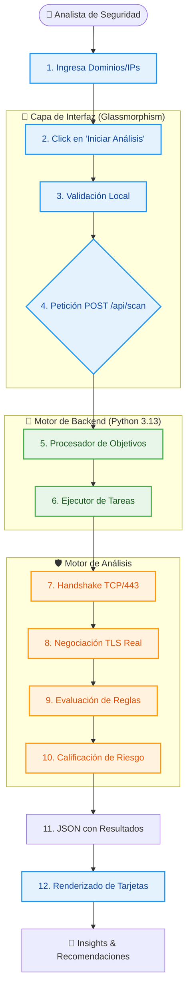

# 🛡️ Operación Defensa Web: Análisis de Configuración TLS

**Análisis de Seguridad de Transporte (TLS) en tiempo real **

Esta herramienta ha sido desarrollada como parte del reto "Operación Defensa Web: Análisis de Configuración TLS" de Risaralda. Proporciona una plataforma robusta para que analistas de seguridad y administradores de sistemas auditen de forma rápida y visual la configuración criptográfica de servidores públicos o privados.

---

## 🗺️ Visualización de Procesos y Flujos 

El siguiente diagrama representa el ciclo de vida completo de un análisis, diseñado para ser intuitivo desde el primer vistazo.



---

## 🚀 ¿Qué hace esta herramienta?

La herramienta permite a un usuario ingresar uno o múltiples dominios o direcciones IP y ejecutar un **escaneo técnico profundo** de sus configuraciones de Seguridad de la Capa de Transporte (TLS). 

A diferencia de herramientas estáticas, este sistema realiza un **handshake real** contra el servidor remoto para detectar qué protocolos están habilitados, evaluando instantáneamente su postura de seguridad frente a los estándares modernos (NIST, OWASP).

---

## 🔍 Tipo de Análisis que realiza

El motor de análisis se basa en una arquitectura de micro-fases integrada:

1.  **Ingesta y Validación**: Procesa y valida sintácticamente los dominios o IPs suministradas.
2.  **Motor TLS (Scan Real)**: 
    *   Efectúa una conexión de socket TCP al puerto 443 del objetivo.
    *   Intenta realizar una negociación TLS utilizando contextos seguros de Python.
    *   Extrae la versión exacta del protocolo (TLS 1.0, 1.1, 1.2 o 1.3).
3.  **Motor de Reglas**: 
    *   Compara la versión detectada contra una base de conocimientos de vulnerabilidades conocidas.
    *   Identifica protocolos obsoletos (vulnerables a ataques) y configuraciones subóptimas.
4.  **Generación de Reporte Detallado**: 
    *   Categoriza el riesgo (Baja, Media, Alta).
    *   Provee una **explicación técnica** del hallazgo.
    *   Ofrece **recomendaciones de endurecimiento (hardening)** accionables.

---

## 🛡️ Identificación de Riesgos de Seguridad

La herramienta es vital para identificar los siguientes riesgos en una infraestructura web:

*   **Protocolos Obsoletos (TLS 1.0/1.1)**: Identifica si el servidor aún soporta estos protocolos, los cuales son vulnerables a ataques de interceptación como **POODLE** y **BEAST**. Marcados como **RIESGO ALTO**.
*   **Configuraciones Subóptimas (TLS 1.2)**: Aunque TLS 1.2 sigue siendo seguro si se configura correctamente, la herramienta lo identifica como **RIESGO MEDIO** para incentivar la migración a TLS 1.3.
*   **Errores de Configuración**: Detecta servidores que no responden adecuadamente en el puerto 443 o que tienen configuraciones TLS rotas, lo que puede causar denegación de servicio o fallos de conexión para clientes legítimos.
*   **Falta de Modernización**: Ayuda a validar el cumplimiento de políticas de seguridad que exigen el uso exclusivo de **TLS 1.3**, el protocolo más seguro y rápido disponible hoy en día.

---

## 🛠️ Tecnologías Utilizadas

*   **Backend**: Python 3.13 (Sockets, SSL, `http.server`).
*   **Frontend**: HTML5, Vanilla JavaScript, Tailwind CSS (Diseño Premium con Glassmorphism).
*   **Iconografía**: Lucide Icons.
*   **Diseño**: Enfoque "Cybersecurity Dark Theme" responsivo y moderno.

---

## 📦 Instalación y Uso Rápido

1.  Asegúrate de estar en el directorio raíz del proyecto.
2.  Ejecuta el servidor maestro:
    ```bash
    python server.py
    ```
3.  Abre tu navegador en: `http://localhost:8000`
4.  Ingresa los dominios (uno por línea) y haz clic en **"Iniciar Análisis"**.

---

*Desarrollado para el reto Risaralda: Análisis de Configuración TLS.*
